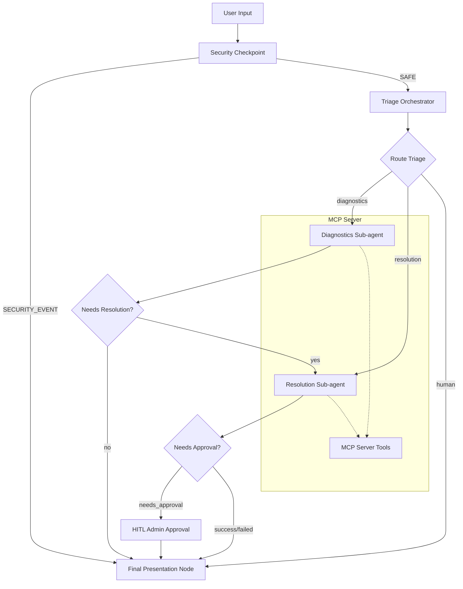

# IT Support Triage Agent — Submission Write-Up

## Problem Statement
IT departments in modern enterprises are flooded with repetitive tickets, ranging from checking if the database is offline to resetting user credentials. These basic queries consume significant human analyst hours and delay resolutions. At the same time, exposing backend APIs (like restarting servers or resetting passwords) directly to raw user inputs presents significant security risks, including PII exposure and prompt/SQL injection attacks.

This agent solves this problem by automating standard triage, running safe system diagnostics, executing admin-approved resolutions via Model Context Protocol (MCP), while securing the boundary using a dedicated Security Checkpoint and human-in-the-loop (HITL) gate.

## Solution Architecture

## Concepts Used

1. **ADK 2.0 Workflow**: The root agent is a structured graph `Workflow` in [`app/agent.py`](app/agent.py#L254-L257) mapping functions, specialized agents, and input prompts.
2. **LlmAgents**: Three specialized LLM sub-agents run context-specific tasks: `triage_orchestrator`, `diagnostics_agent`, and `resolution_agent` (defined in [`app/agent.py`](app/agent.py#L111-L200)).
3. **AgentTool / MCP Server**: Connected via `MCPToolset` in [`app/agent.py`](app/agent.py#L32-L39) to the FastMCP server [`app/mcp_server.py`](app/mcp_server.py) to inspect status, restart services, and reset credentials.
4. **Security Checkpoint**: The `security_checkpoint` function node in [`app/agent.py`](app/agent.py#L51-L108) filters all inputs before LLM processing.
5. **Agents CLI**: Project created, managed, and verified locally using `agents-cli scaffold` and `agents-cli playground` tools.

## Security Design

* **PII Redaction**: Email addresses, passwords, and IP addresses are scrubbed using pre-compiled regex before queries reach downstream LLM agents. This prevents leakage of sensitive staff records into model prompts.
* **Injection Detection**: Common SQL injection sequences (`DROP DATABASE`) and prompt injection overrides (`ignore previous instructions`) are flagged immediately.
* **Audit Logging**: Every input creates a structured JSON log recording metadata, PII indicators, threat detection status, and severity. This ensures compliance with IT compliance standards.
* **Admin Approval Verification**: Destructive/sensitive modifications (e.g. password resets) are routed to an HITL approval step, preventing unauthorized actions.

## MCP Server Design
* `check_system_status`: Inspects service health.
* `reset_user_password`: Generates secure temp credentials.
* `restart_service`: Restarts active components.

## Human-in-the-Loop (HITL) Flow
Administrator approval is requested via `approval_node` using `RequestInput` for password resets. The flow halts execution and prompts the IT Administrator to reply with `yes` or `no`. A positive reply triggers temp password generation; a negative reply blocks it.

## Demo Walkthrough
1. **Diagnostics**: Asking about database health triggers `check_system_status` to report latency.
2. **HITL Password Reset**: Requesting a reset triggers the admin approval prompt.
3. **Security Block**: Sending SQL injections triggers the security block, denying execution.

## Impact & Value Statement
* **Reduces MTTR** (Mean Time to Resolution) from hours to seconds for routine diagnostic and restart issues.
* **Saves IT Admin Overhead** by automating 80% of trivial triage.
* **Guarantees Safety** by ensuring PII scrubbing and enforcing admin control over sensitive changes.
